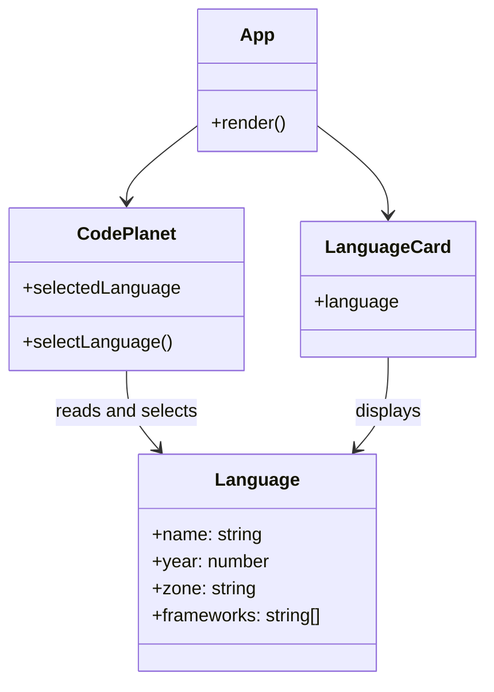
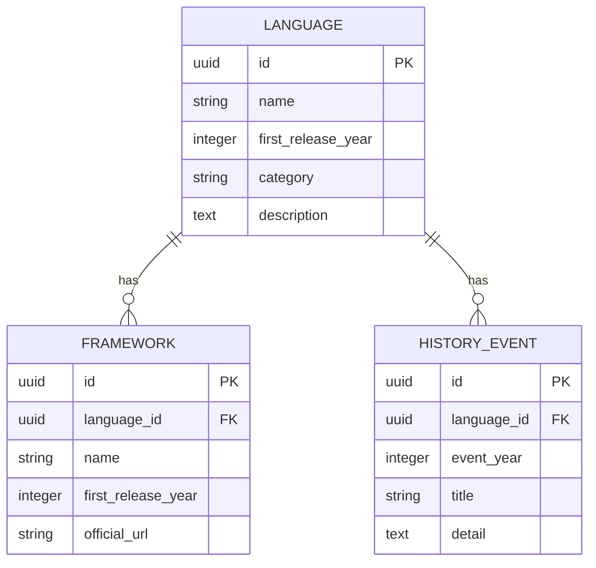

# Code Travel — Project Design

## Scope (MVP)

- React + Vite front end; five completed routes: Home, Destinations, Language Detail, Timeline, About.
- Home contains an interactive **Code Planet**. The current version uses CSS visuals and React state so it is lightweight and responsive.
- Programming-language data stays in a local array first. It can later be replaced by an API without changing the page layout.

## Front-end component / data UML

## Later backend UML

## Back-end plan (after front-end MVP)

1. Create a Django project with Django REST Framework and PostgreSQL.
2. Add `Language`, `Framework`, and `HistoryEvent` models and seed the six initial languages.
3. Expose read-only endpoints: `/api/languages/`, `/api/languages/:slug/`, and `/api/timeline/`.
4. Replace `src/data/languages.js` with a fetch hook, including loading and error states.
5. Optional: Django Admin for maintaining content; authentication only if users need bookmarks or personal travel routes.

## Responsive rules

- Desktop: text and globe in two columns.
- Tablet/mobile: globe moves above text, width stays below 74vw, detail card is centred.
- Use `prefers-reduced-motion` to stop animation when a user asks for less motion.
- Future Three.js version should use a low-detail/mobile fallback and pause rendering when off-screen.
